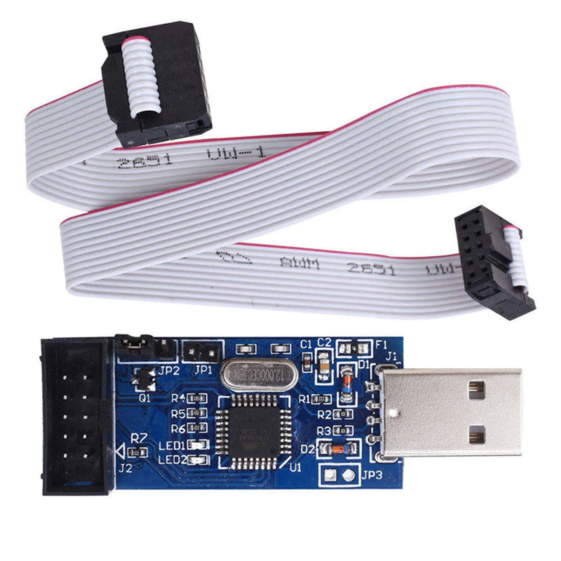

# Bare-Metal Snake Game on AtMega328P

This project is a **bare-metal implementation** of the classic **Nokia Snake game**, written for the **AtMega328P microcontroller**. 
It uses an **I²C OLED display** for rendering the game, with no RTOS or external libraries — making it a perfect hands-on project for learning embedded systems fundamentals.

This project is designed as a **stepping stone** for anyone beginning their journey in embedded systems. 
By building this game, you will gain practical exposure to:
- Bare-metal programming (no Arduino/CubeIDE abstractions) 
- I²C communication and OLED interfacing 
- Timer-based delays and event handling 
- GPIO input handling 
- Memory and resource management on a limited MCU 

## Hardware
- **MCU:** AtMega328P 
- **Display:** SSD1306 OLED (I²C interface)
- **Input:** GPIO buttons (Up, Down, Left, Right, Select)
- **Flashing:** USBASP

