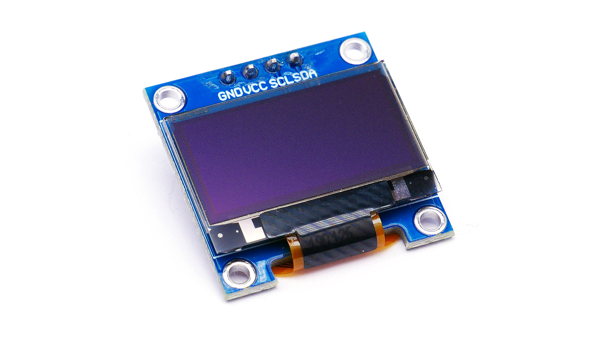

# Bare-Metal Snake Game on AtMega328P

This project is a **bare-metal implementation** of the classic **Nokia Snake game**, written for the **AtMega328P microcontroller**. 
It uses an **I²C OLED display** for rendering the game, with no RTOS or external libraries — making it a perfect 
hands-on project for learning embedded systems fundamentals.

This project is designed as a **stepping stone** for anyone beginning their journey in embedded systems. 
By building this game, you will gain practical exposure to:
- Bare-metal programming (no Arduino/CubeIDE abstractions) 
- I²C communication and OLED interfacing 
- Timer-based delays and event handling 
- GPIO input handling 
- Memory and resource management on a limited MCU 

## Hardware
- **MCU:** AtMega328P 
- **Display:** SH1106 OLED (I²C interface)

  
- **Flashing:** USBASP

 
 
- **Input:** GPIO buttons (Up, Down, Left, Right, Select)

## I²C on ATmega328P

The ATmega328P has a built-in Two-Wire Interface (TWI) module, which implements the I²C protocol.
The ATmega328p data sheet section 21 explains the working of I2C with the resister details in the MCU.

#### Communication is controlled through a set of registers:

- TWBR (TWI Bit Rate Register): Sets the SCL clock frequency along with prescaler bits.

- TWSR (TWI Status Register): Contains status codes for monitoring I²C events (start sent, data acknowledged, etc.) and prescaler settings.

- TWDR (TWI Data Register): Holds the data to be transmitted or received.

- TWCR (TWI Control Register): Used to enable I²C, generate START/STOP conditions, acknowledge reception, and initiate data transfers.

- TWAR (TWI Address Register): Holds the slave address when the MCU operates as a slave.

#### Basic workflow for I²C master transmit:

- Set START condition using TWCR.

- Wait for TWINT flag (operation complete).

- Load the slave address + R/W bit into TWDR, send, and wait for ACK.

- Send control byte (command/data select).

- Send command(s) or data byte(s) as needed.

- Issue STOP condition.

## SH1106 OLED Controller

The SH1106 is a graphic display driver IC designed to control a 128×64 pixel monochrome OLED panel.

#### 1. Memory Organization

- The SH1106 has 132 × 64 bits of internal display RAM.

- Only 128 × 64 pixels are visible on the screen — the extra 4 columns are hidden (commonly requiring a column offset of 2 when writing data).

- The RAM is divided into 8 pages (page 0 → page 7).

- Each page = 128 columns × 8 rows of pixels.

- Each byte in RAM controls 8 vertical pixels (1 bit = 1 pixel ON/OFF).

So instead of addressing each pixel individually, you write one byte at a time that maps to 8 vertical pixels in the display.

#### 2. Display Update Process

To draw on the screen, you:

- Select a page address (0xB0–0xB7).

- Set the column address (low + high nibble).

- Send data bytes → each byte lights up a column of 8 vertical pixels in that page.

Example:

Sending 0xFF to a column → all 8 pixels in that column are ON.

Sending 0x00 → all 8 pixels are OFF.

Sending 0b10101010 → alternating ON/OFF pixels.

#### 3. Commands vs Data

Commands configure the display:

Turn ON/OFF (0xAF / 0xAE)

Set contrast (0x81)

Set addressing/page (0xB0–0xB7)

Scroll, inversion, display offset, etc.

Data represents actual pixel information to be written into display RAM.

## Button interface
You can use the INT0 external interrupt on the ATmega328P to interface with a push button.

#### INT0

INT0 is the external interrupt connected to pin PD2 (Digital Pin 2 on an Arduino). This interrupt is highly flexible and
can be configured to trigger on four different types of edge/level changes:

   Low level: The interrupt is continuously triggered as long as the PD2 pin is low.

   Logical change: The interrupt is triggered on any logical change, whether it's a transition from low to high or high to low.

   Falling edge: The interrupt is triggered specifically when the pin voltage drops from high to low.

   Rising edge: The interrupt is triggered specifically when the pin voltage rises from low to high.

**Configuration**

To set up INT0 as a push button interface, you need to configure two main registers:

**EICRA** :
This register determines the trigger condition. For a falling-edge trigger, you must set the ISC01 bit to 1 and 
the ISC00 bit to 0. This tells the microcontroller to fire the interrupt only when the PD2 pin voltage falls.

**EIMSK** :
This register enables the specific interrupt. To enable INT0, you must set the INT0 bit to 1. Without this, 
the interrupt will not be active even if the trigger condition is met.